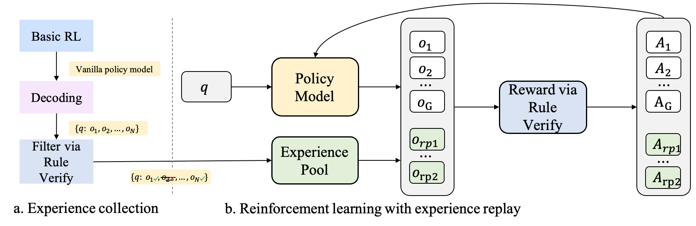

# RLEP: Reinforcement Learning with Experience Replay for LLM Reasoning

<p align="center">
  
</p>

> RL training is an energy‑intensive journey. Leveraging collected experience, RLEP rapidly converges on promising reasoning paths and achieves stronger final results.


# Summary 
*RLEP*—**R**einforcement **L**earning with **E**xperience re**P**lay—first collects verified successful trajectories and then replays them during subsequent training. At every update step, the policy is optimized on mini‑batches that blend newly generated rollouts with these replayed successes. By replaying high‑quality examples, RLEP steers the model away from fruitless exploration, focuses learning on promising reasoning paths, and delivers both faster convergence and stronger final performance.

<p align="center">
  
</p>

Experimental results show that RLEP reaches the vanilla‑RL baseline’s best score much sooner —and ultimately pushes that score even higher.
* **Rapid early gains.** On AIME‑2024 RLEP hits the baseline’s peak accuracy by step 135 (the baseline needs 380). On AIME‑2025 it surpasses the baseline’s best score after only 50 steps.

* **Higher final performance.** RLEP ultimately lifts the peak accuracy from 38.2 % → 39.9 % (AIME‑2024), 19.8 % → 22.3 % (AIME‑2025), and 77.0 % → 82.2 % on AMC‑2023 benchmark. 

<p align="center">
  
</p>

# Training

```Training code and ckpt coming soon!```
